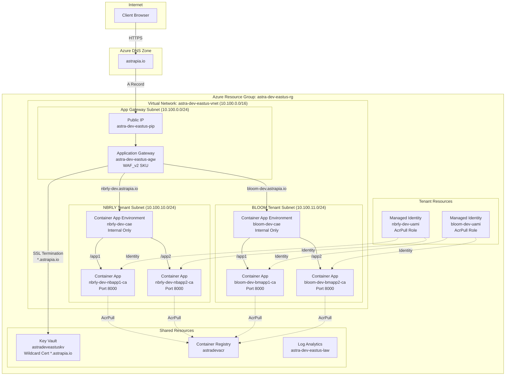

# Application Gateway Apps - Technical Design & Architecture

## Overview

This document provides the technical design and detailed architecture for implementing multi-tenant FastAPI applications with Azure Container Apps, featuring Application Gateway for secure ingress and rule-based routing.

## Detailed Architecture

### Network Topology



## Routing Configuration Details

### Application Gateway Configuration

#### Backend Pools
```yaml
Backend Pools:
  - Name: nbrly-backend-pool
    Targets: 
      - Type: IP/FQDN
      - Value: <nbrly-dev-cae-static-ip>
        
  - Name: bloom-backend-pool  
    Targets:
      - Type: IP/FQDN
      - Value: <bloom-dev-cae-static-ip>
```

#### Listeners & Routing Rules
```yaml
Listeners:
  - Name: nbrly-listener
    Protocol: HTTPS
    Port: 443
    HostName: nbrly-dev.astrapia.io
    Certificate: *.astrapia.io (from Key Vault)
    
  - Name: bloom-listener
    Protocol: HTTPS 
    Port: 443
    HostName: bloom-dev.astrapia.io
    Certificate: *.astrapia.io (from Key Vault)

Routing Rules:
  - Name: nbrly-routing-rule
    Priority: 100
    Listener: nbrly-listener
    Backend Pool: nbrly-backend-pool
    Backend Settings: internal-https-settings
    
  - Name: bloom-routing-rule
    Priority: 200
    Listener: bloom-listener
    Backend Pool: bloom-backend-pool
    Backend Settings: internal-https-settings
```

#### Backend Settings
```yaml
Backend Settings:
  - Name: internal-https-settings
    Protocol: HTTPS
    Port: 443
    Override Hostname: Yes
    Hostname Override: Pick from backend target
    Well Known CA Certificate: Yes
    Request Header Rewrite:
      - Header: X-Forwarded-Host
        Value: {http_req_host}
```

#### Health Probes
```yaml
Health Probes:
  - Name: container-app-health-probe
    Protocol: HTTPS
    Path: /health
    Interval: 30 seconds
    Timeout: 30 seconds
    Unhealthy Threshold: 3
    Match Conditions:
      Status Codes: 200-399
```

### Container App Environment Routing

#### NBRLY Environment (nbrly-dev-cae)
```yaml
# nbrly-routing-config.yaml
apiVersion: apps/v1
kind: HTTPRouteConfiguration
metadata:
  name: nbrly-route-config
spec:
  customDomains:
    - name: nbrly-dev.astrapia.io
      bindingType: SniEnabled
      certificateId: /subscriptions/{subscription}/resourceGroups/astra-dev-eastus-rg/providers/Microsoft.App/managedEnvironments/nbrly-dev-cae/certificates/astrapia-wildcard-cert
  
  routes:
    - description: "Route /app1 to nbapp1"
      match:
        pathSeparatedPrefix: "/app1"
      action:
        prefixRewrite: "/"
      targets:
        - containerApp: "nbrly-dev-nbapp1-ca"
          
    - description: "Route /app2 to nbapp2"  
      match:
        pathSeparatedPrefix: "/app2"
      action:
        prefixRewrite: "/"
      targets:
        - containerApp: "nbrly-dev-nbapp2-ca"
```

#### BLOOM Environment (bloom-dev-cae)  
```yaml
# bloom-routing-config.yaml
apiVersion: apps/v1
kind: HTTPRouteConfiguration
metadata:
  name: bloom-route-config
spec:
  customDomains:
    - name: bloom-dev.astrapia.io
      bindingType: SniEnabled  
      certificateId: /subscriptions/{subscription}/resourceGroups/astra-dev-eastus-rg/providers/Microsoft.App/managedEnvironments/bloom-dev-cae/certificates/astrapia-wildcard-cert
      
  routes:
    - description: "Route /app1 to bmapp1"
      match:
        pathSeparatedPrefix: "/app1"
      action:
        prefixRewrite: "/"
      targets:
        - containerApp: "bloom-dev-bmapp1-ca"
        
    - description: "Route /app2 to bmapp2"
      match:
        pathSeparatedPrefix: "/app2" 
      action:
        prefixRewrite: "/"
      targets:
        - containerApp: "bloom-dev-bmapp2-ca"
```

## FastAPI Application Design

### Application Structure
```python
# Common structure for all 4 applications
app-gtwy-apps/
├── nbrly/
│   ├── nbapp1/
│   │   ├── main.py          # FastAPI app with root_path="/app1"
│   │   ├── requirements.txt # Dependencies
│   │   ├── Dockerfile       # Multi-stage build
│   │   └── .dockerignore    # Optimize build context
│   └── nbapp2/
│       ├── main.py          # FastAPI app with root_path="/app2"  
│       ├── requirements.txt
│       ├── Dockerfile
│       └── .dockerignore
└── bloom/
    ├── bmapp1/ # Same structure as nbapp1
    └── bmapp2/ # Same structure as nbapp2
```

### FastAPI Configuration Template
```python
# Common configuration for all applications
from fastapi import FastAPI
import os

# Environment-specific root path
ROOT_PATH = os.getenv("ROOT_PATH", "/app1")  # /app1 or /app2
APP_NAME = os.getenv("APP_NAME", "NBRLY-App1")

app = FastAPI(
    title=f"{APP_NAME} API",
    description="Multi-tenant FastAPI application",
    version="1.0.0",
    root_path=ROOT_PATH,  # Critical for proper path routing
    docs_url=f"{ROOT_PATH}/docs",  # Swagger UI
    redoc_url=f"{ROOT_PATH}/redoc"  # ReDoc
)

# Health check endpoints
@app.get("/health")
async def health_check():
    return {"status": "healthy", "app": APP_NAME}

@app.get("/health/ready")  
async def readiness_check():
    return {"status": "ready", "app": APP_NAME}

@app.get("/health/live")
async def liveness_check():
    return {"status": "alive", "app": APP_NAME}
```

### Container App YAML Template
```yaml
# containerapp-template.yaml
apiVersion: apps/v1
kind: ContainerApp
metadata:
  name: ${CONTAINER_APP_NAME}  # e.g., nbrly-dev-nbapp1-ca
spec:
  environmentId: /subscriptions/${SUBSCRIPTION_ID}/resourceGroups/astra-dev-eastus-rg/providers/Microsoft.App/managedEnvironments/${CAE_NAME}
  
  configuration:
    activeRevisionsMode: single
    ingress:
      external: false  # Internal only
      targetPort: 8000
      transport: http
      traffic:
        - weight: 100
          latestRevision: true
    
    secrets:
      - name: database-connection-string
        keyVaultUrl: ${KEY_VAULT_SECRET_URL}
        identity: ${MANAGED_IDENTITY_ID}
        
    registries:
      - server: astradevacr.azurecr.io
        identity: ${MANAGED_IDENTITY_ID}

  template:
    containers:
      - name: ${CONTAINER_NAME}
        image: astradevacr.azurecr.io/${IMAGE_NAME}:${IMAGE_TAG}
        env:
          - name: ROOT_PATH
            value: ${ROOT_PATH}  # /app1 or /app2
          - name: APP_NAME
            value: ${APP_NAME}
          - name: DATABASE_URL
            secretRef: database-connection-string
            
        resources:
          cpu: 0.5
          memory: 1Gi
          
        probes:
          liveness:
            httpGet:
              path: /health/live
              port: 8000
            initialDelaySeconds: 15
            periodSeconds: 30
            
          readiness:
            httpGet:
              path: /health/ready
              port: 8000
            initialDelaySeconds: 5
            periodSeconds: 10
    
    scale:
      minReplicas: 2  # High availability
      maxReplicas: 10  # Auto-scaling
      rules:
        - name: http-concurrency-rule
          http:
            metadata:
              concurrentRequests: "55"
```

## Security Configuration

### Managed Identity Configuration
```bash
# Grant ACR pull access to tenant managed identities
az role assignment create \
  --assignee ${NBRLY_MANAGED_IDENTITY_ID} \
  --role "AcrPull" \
  --scope ${ACR_RESOURCE_ID}

az role assignment create \
  --assignee ${BLOOM_MANAGED_IDENTITY_ID} \
  --role "AcrPull" \
  --scope ${ACR_RESOURCE_ID}
```

### Key Vault Access Policy
```bash
# Grant secret access to Container Apps via managed identities
az keyvault set-policy \
  --name astradeveastuskv \
  --object-id ${NBRLY_MANAGED_IDENTITY_PRINCIPAL_ID} \
  --secret-permissions get list

az keyvault set-policy \
  --name astradeveastuskv \
  --object-id ${BLOOM_MANAGED_IDENTITY_PRINCIPAL_ID} \
  --secret-permissions get list
```

### Network Security Groups
```bash
# NSG rules for Container App Environment subnets
# Allow inbound HTTPS from Application Gateway subnet
az network nsg rule create \
  --resource-group astra-dev-eastus-rg \
  --nsg-name snet-nbrly-dev-cae-nsg \
  --name AllowAppGatewayInbound \
  --priority 100 \
  --source-address-prefixes 10.100.0.0/24 \
  --destination-port-ranges 443 \
  --access Allow \
  --protocol Tcp
```

## Deployment Automation

### Build & Push Script Template
```bash
#!/bin/bash
# build-push-template.sh

set -euo pipefail

# Configuration
TENANT_NAME="${1:-nbrly}"  # nbrly or bloom
ACR_NAME="astradevacr"
RESOURCE_GROUP="astra-dev-eastus-rg"

# Application mapping
declare -A APPS
if [[ "$TENANT_NAME" == "nbrly" ]]; then
    APPS["nbapp1"]="/app1"
    APPS["nbapp2"]="/app2"
else
    APPS["bmapp1"]="/app1" 
    APPS["bmapp2"]="/app2"
fi

# Build and push each application
for app in "${!APPS[@]}"; do
    echo "Building and pushing ${TENANT_NAME}/${app}..."
    
    IMAGE_NAME="${TENANT_NAME}-dev-${app}"
    IMAGE_TAG="latest"
    FULL_IMAGE="${ACR_NAME}.azurecr.io/${IMAGE_NAME}:${IMAGE_TAG}"
    
    # Build image
    docker build \
        -t "$FULL_IMAGE" \
        -f "${TENANT_NAME}/${app}/Dockerfile" \
        "${TENANT_NAME}/${app}/"
    
    # Push to ACR
    az acr build \
        --registry "$ACR_NAME" \
        --resource-group "$RESOURCE_GROUP" \
        --image "${IMAGE_NAME}:${IMAGE_TAG}" \
        "${TENANT_NAME}/${app}/"
        
    echo "Successfully built and pushed $FULL_IMAGE"
done
```

### Container App Deployment Script
```bash
#!/bin/bash
# deploy-containerapp-template.sh

set -euo pipefail

# Parameters
TENANT_NAME="${1:-nbrly}"
APP_NAME="${2:-nbapp1}" 
ROOT_PATH="${3:-/app1}"

# Configuration
RESOURCE_GROUP="astra-dev-eastus-rg"
SUBSCRIPTION_ID=$(az account show --query id -o tsv)

# Generate names using naming conventions
CAE_NAME="${TENANT_NAME}-dev-cae"
CONTAINER_APP_NAME="${TENANT_NAME}-dev-${APP_NAME}-ca"
MANAGED_IDENTITY_NAME="${TENANT_NAME}-dev-uami"
IMAGE_NAME="${TENANT_NAME}-dev-${APP_NAME}"

# Get managed identity resource ID
MANAGED_IDENTITY_ID=$(az identity show \
    --name "$MANAGED_IDENTITY_NAME" \
    --resource-group "$RESOURCE_GROUP" \
    --query id -o tsv)

# Deploy container app using YAML
envsubst < templates/containerapp-template.yaml | \
    az containerapp create \
        --resource-group "$RESOURCE_GROUP" \
        --yaml -

echo "Successfully deployed $CONTAINER_APP_NAME"
```

## Monitoring & Observability

### Application Insights Integration
```yaml
# Add to container app template
env:
  - name: APPLICATIONINSIGHTS_CONNECTION_STRING
    secretRef: appinsights-connection-string
    
  - name: OTEL_PYTHON_LOGGING_AUTO_INSTRUMENTATION_ENABLED
    value: "true"
```

### Health Check Monitoring
```bash
# Health check validation script
#!/bin/bash

ENDPOINTS=(
    "https://nbrly-dev.astrapia.io/app1/health"
    "https://nbrly-dev.astrapia.io/app2/health" 
    "https://bloom-dev.astrapia.io/app1/health"
    "https://bloom-dev.astrapia.io/app2/health"
)

for endpoint in "${ENDPOINTS[@]}"; do
    echo "Checking $endpoint..."
    curl -f -s "$endpoint" || echo "❌ Failed: $endpoint"
    echo "✅ Success: $endpoint"
done
```

## Performance Optimization

### Container Resource Configuration
- **CPU**: 0.5 vCPU per replica (Azure Container Apps constraint)
- **Memory**: 1 GiB per replica  
- **Auto-scaling**: HTTP concurrency rule (55 requests/replica)
- **Min replicas**: 2 (High Availability)
- **Max replicas**: 10 (Cost control)

### Application Gateway Optimization
- **SKU**: WAF_v2 (2 instances minimum for HA)
- **Autoscaling**: Enabled (2-10 instances)
- **Connection draining**: Enabled (30 seconds)
- **Keep-alive**: Enabled
- **HTTP/2**: Enabled

This technical design provides the foundation for implementing a robust, secure, and scalable multi-tenant application architecture following Azure best practices.