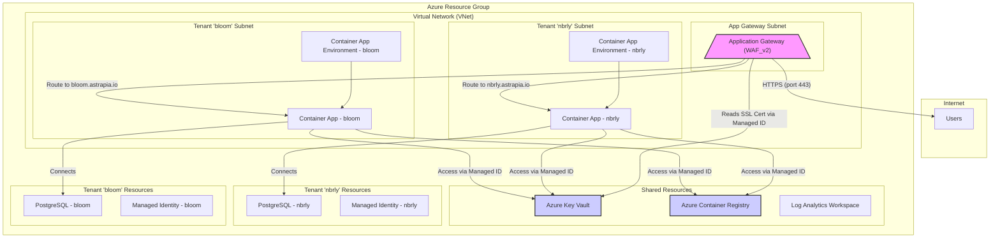

# Azure Container Apps & Application Gateway - Implementation Plan

This document details the implementation of a secure, multi-tenant infrastructure on Azure using Azure Container Apps and an Application Gateway for ingress. The deployment is orchestrated through a suite of idempotent Azure CLI scripts.

## 1. Architecture Overview

The architecture is designed to be multi-tenant, with a clear separation between shared "common" infrastructure and tenant-specific resources.

-   **Shared Infrastructure**: A single Virtual Network (VNet) houses all components. An Application Gateway (WAF_v2 SKU) acts as the central, secure ingress point for all tenants. Other shared resources include an Azure Key Vault for secrets and certificates, an Azure Container Registry (ACR) for Docker images, and a Log Analytics Workspace for monitoring.
-   **Tenant Infrastructure**: Each tenant (e.g., `nbrly`, `bloom`) is provisioned with its own dedicated resources within a unique subnet. This includes a Container App Environment, a PostgreSQL Flexible Server database, and a User-Assigned Managed Identity for secure access to other Azure resources.
-   **Networking & Security**:
    -   The Application Gateway has a public IP address and terminates SSL/TLS for all incoming traffic using a wildcard certificate stored in Key Vault.
    -   All Container Apps are configured to be **internal-only**, meaning they are only accessible from within the VNet, specifically from the Application Gateway.
    -   Managed Identities are used extensively for passwordless authentication (e.g., Application Gateway accessing Key Vault, Container Apps accessing ACR and Key Vault).

### Architecture Diagram



## 2. Directory Structure

The `iac-cli` directory contains all scripts and configuration files.

```
iac-cli/
├── config/
│   ├── .generated/
│   │   └── generated-infra-dev.json  # State file (auto-generated)
│   ├── bloom/
│   │   └── parameters-dev.json       # Tenant 'bloom' config
│   ├── nbrly/
│   │   └── parameters-dev.json       # Tenant 'nbrly' config
│   └── parameters-dev.json           # Common infrastructure config
├── creds/
│   ├── astrapiaio.json               # Certificate password
│   └── azure-credentials-dev.cred    # Service Principal credentials
├── scripts/
│   ├── 00-deploy-all.sh              # Main deployment script
│   ├── 01-deploy-common-infra.sh     # Deploys shared resources
│   ├── 02-deploy-tenant-infra.sh     # Wrapper to deploy all tenants
│   ├── bloom/
│   │   ├── 01-deploy-tenant-resources.sh
│   │   └── 02-configure-routing.sh
│   ├── nbrly/
│   │   ├── 01-deploy-tenant-resources.sh
│   │   └── 02-configure-routing.sh
│   └── helpers/
│       ├── azure-login.sh
│       └── logging.sh
└── ...
```

## 3. State Management

A critical feature of this implementation is **state management**.

-   **File**: `iac-cli/config/.generated/generated-infra-dev.json`
-   **Purpose**: As resources are created, their names, IDs, and other important outputs (like IP addresses) are written to this JSON file.
-   **Benefit**: Subsequent scripts can read from this file to reference resources created in previous steps. This decouples the scripts and allows them to be run independently, provided the state file is present. It eliminates the need to pass variables between scripts or hardcode resource names.

## 4. Deployment Scripts & Logic

The deployment is modular and designed to be **idempotent**, meaning the scripts can be run multiple times without causing errors or creating duplicate resources. This is achieved by checking for the existence of a resource (`az ... show`) before attempting to create it (`az ... create`).

### `00-deploy-all.sh`
The master script that executes all other deployment scripts in the correct order.

### `01-deploy-common-infra.sh`
This script provisions all the shared resources:
1.  Creates the central Resource Group.
2.  Creates the VNet and necessary subnets (for the App Gateway and each tenant).
3.  Provisions the Key Vault, ACR, and Log Analytics Workspace.
4.  Creates a User-Assigned Managed Identity for the Application Gateway.
5.  Grants this identity `get` and `list` permissions for secrets and certificates on the Key Vault.
6.  Provisions the Application Gateway with a public IP and WAF configuration.
7.  **SSL/TLS Setup**:
    -   Imports the wildcard SSL certificate (`.pfx` file) into Key Vault.
    -   Adds the certificate from Key Vault to the Application Gateway.
    -   Creates a frontend port `port_443` for HTTPS traffic.

### `02-deploy-tenant-infra.sh`
A wrapper script that iterates through the tenant configuration folders (e.g., `nbrly`, `bloom`) and executes their respective deployment scripts.

### `/{tenant}/01-deploy-tenant-resources.sh`
This script provisions resources for a single tenant:
1.  Creates a dedicated User-Assigned Managed Identity for the tenant.
2.  Grants this identity `AcrPull` access on the ACR and read access on the Key Vault.
3.  Provisions the PostgreSQL Flexible Server.
4.  Provisions the Container App Environment in the tenant's dedicated subnet.

### `/{tenant}/02-configure-routing.sh`
This script configures the Application Gateway to route traffic to the tenant's application:
1.  **Backend Pool**: Creates a backend pool pointing to the tenant's Container App's static IP address.
2.  **Health Probe**: Creates an **HTTPS** health probe to monitor the health of the tenant's endpoint.
3.  **HTTP Settings**: Configures settings for backend communication, including setting the hostname for requests to match the tenant's domain, which is essential for SNI.
4.  **HTTPS Listener**: Creates a listener for the tenant's specific hostname (e.g., `nbrly.astrapia.io`) on port 443, associating it with the SSL certificate.
5.  **Routing Rule**: Ties the HTTPS listener, backend pool, and HTTP settings together to create the end-to-end request path.

## 5. Deployment Steps

1.  **Prerequisites**:
    -   Azure CLI
    -   `jq` command-line JSON processor.

2.  **Configuration**:
    -   Fill in `iac-cli/creds/azure-credentials-dev.cred` with your Service Principal details.
    -   Fill in `iac-cli/creds/astrapiaio.json` with the password for your SSL certificate.
    -   Ensure your `.pfx` certificate file is in the location specified in `iac-cli/config/parameters-dev.json`.

3.  **Execution**:
    -   Navigate to the `iac-cli/scripts` directory.
    -   Make the scripts executable: `chmod +x **/*.sh`
    -   Run the main deployment script: `./00-deploy-all.sh`

4.  **Verification**:
    -   Monitor the logs in the console for progress and any potential errors.
    -   Once complete, inspect the `iac-cli/config/.generated/generated-infra-dev.json` file to see the details of all created resources.
    -   Access your applications via their HTTPS URLs (e.g., `https://nbrly.astrapia.io`, `https://bloom.astrapia.io`).
