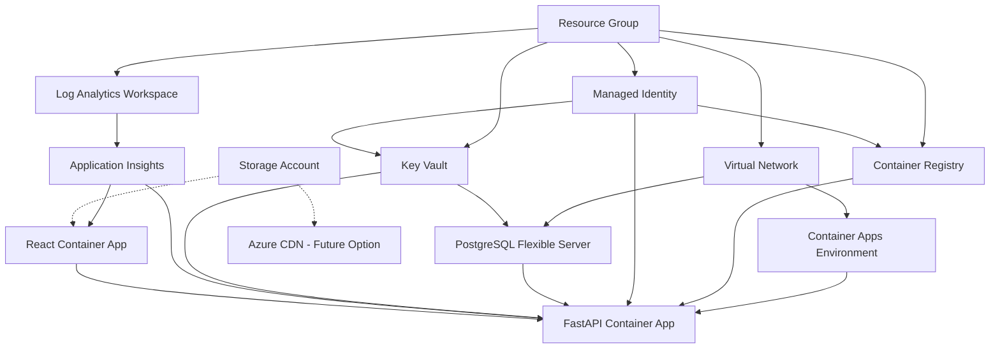

# Azure Infrastructure Requirements

## Project Overview
Full-stack web application with the following technology stack:
- **Frontend**: React (Single Page Application)
- **Backend**: Python FastAPI (REST API)
- **Database**: PostgreSQL
- **Infrastructure**: Azure Cloud Platform

## Architecture Summary
- React frontend deployed on Azure Container Apps (with future exploration of Azure Blob Website hosting)
- Python FastAPI backend deployed on Azure Container Apps
- PostgreSQL database hosted on Azure Database for PostgreSQL - Flexible Server
- Container images stored in Azure Container Registry
- All components integrated with Virtual Network for secure communication
- Secrets management through Azure Key Vault
- Monitoring and logging via Azure Monitor and Log Analytics

## Core Azure Services Required

### 1. Resource Group
**Service**: Azure Resource Group
- **Purpose**: Logical container for all application resources
- **Naming Convention**: `{{project}}-{{env}}-{{region}}-rg`
- **Example**: `nbrly-prod-eastus-rg`

### 2. Frontend Hosting
**Primary Service**: Azure Container Apps
- **Purpose**: Host React SPA as containerized application
- **Features Required**:
  - Container orchestration for React build
  - Auto-scaling (0 to N instances)
  - HTTPS ingress with SSL termination
  - Custom domain support
  - Environment variables for configuration
  - Health probes support
  - Blue-green deployments
- **Naming Convention**: `{{project}}-{{env}}-{{region}}-frontend-ca`

**Future Alternative**: Azure Blob Storage Website (Static Website Hosting)
- **Purpose**: Cost-effective static hosting with CDN integration
- **Features for Future Consideration**:
  - Static website hosting capability
  - Azure CDN integration for global distribution
  - Custom domain with SSL/TLS certificates
  - Significantly lower cost for static content
  - Simple deployment pipeline
- **Naming Convention**: `{{project}}{{env}}{{region}}web` (for storage account)
- **Migration Path**: Evaluate after initial Container Apps deployment

### 3. Backend API Hosting
**Service**: Azure Container Apps Environment + Multiple Container Apps
- **Purpose**: Host multiple Python FastAPI applications with shared infrastructure
- **Container Apps Environment**:
  - **Naming Convention**: `{{project}}-{{env}}-{{region}}-cae`
  - **Features**: Shared runtime environment for all backend services
  - **Virtual Network Integration**: Connected to dedicated subnet
  - **Shared Resources**: Log Analytics, monitoring, and networking

- **Individual Backend Container Apps**:
  - **Purpose**: Each API service deployed as separate Container App
  - **Features Required**:
    - Container orchestration per service
    - Independent auto-scaling (0 to N instances per service)
    - HTTPS ingress with SSL termination
    - Service-specific environment variables and secrets management
    - Health probes support per service
    - Blue-green deployments per service
    - Internal service-to-service communication
  - **Naming Convention**: `{{project}}-{{env}}-{{region}}-{{apiName}}-ca`
  - **Examples**:
    - `nbrly-prod-eastus-auth-ca` (Authentication API)
    - `nbrly-prod-eastus-user-ca` (User Management API)
    - `nbrly-prod-eastus-content-ca` (Content API)

### 4. Container Registry
**Service**: Azure Container Registry (ACR)
- **Purpose**: Store and manage Docker container images
- **Features Required**:
  - Private container registry
  - Managed identity authentication
  - Image vulnerability scanning
  - Geo-replication (for production)
  - Webhook integration for automated deployments
- **SKU**: Basic (dev/test), Standard/Premium (production)
- **Naming Convention**: `{{project}}{{env}}{{region}}acr` (no hyphens allowed)

### 5. Database
**Service**: Azure Database for PostgreSQL - Flexible Server
- **Purpose**: Managed PostgreSQL database service
- **Features Required**:
  - High availability with zone redundancy
  - Automated backups (7-35 days retention)
  - Point-in-time restore
  - SSL/TLS encryption in transit
  - Private endpoint connectivity
  - Performance monitoring
  - Connection pooling (PgBouncer)
- **SKU**: Burstable (dev/test), General Purpose/Memory Optimized (production)
- **Naming Convention**: `{{project}}-{{env}}-{{region}}-psql`

### 6. Networking
**Service**: Azure Virtual Network (VNet)
- **Purpose**: Secure network isolation and communication
- **Components Required**:
  - VNet with multiple subnets
  - Subnet for Container Apps Environment
  - Subnet for PostgreSQL private endpoint
  - Network Security Groups (NSGs)
  - Private DNS zones
- **Naming Convention**: 
  - VNet: `{{project}}-{{env}}-{{region}}-vnet`
  - Subnets: `{{project}}-{{env}}-{{region}}-subnet-{{purpose}}`

**Capacity Planning Guidelines**:

#### Development Environment (Optimized for 200 Container Apps, 30 Private Endpoints)
- **VNet CIDR**: `10.0.0.0/22` (1,024 total IPs)
  - Efficient allocation for development workloads
  - 64x reduction from typical /16 allocation while maintaining growth capacity
  
- **Container Apps Environment Subnet**: `10.0.0.0/23` (512 IPs)
  - Supports up to 200 Container Apps with auto-scaling replicas
  - Calculation: Each Container App with replicas uses 2-3 IPs on average
  - Provides headroom for burst scaling scenarios
  - Azure reserves 5 IPs per subnet (network, broadcast, gateways)
  
- **Private Endpoints Subnet**: `10.0.2.0/26` (64 IPs)
  - Supports up to 30 private endpoints (each uses 1 IP)
  - Suitable for: PostgreSQL, Storage, Key Vault, ACR (if needed), future services
  - Provides 100% capacity buffer for expansion
  
- **Reserved for Future Expansion**: `10.0.2.64/26` through `10.0.3.255/24`
  - Additional subnets for AKS, VMs, Application Gateway, or other services
  - Maintains consistent /22 VNet for simplified management

#### Staging Environment (Moderate Scale)
- **VNet CIDR**: `10.1.0.0/21` (2,048 total IPs)
- **Container Apps Subnet**: `10.1.0.0/22` (1,024 IPs) - supports 400+ Container Apps
- **Private Endpoints Subnet**: `10.1.4.0/25` (128 IPs) - supports 60+ endpoints
- **Load Balancer/Gateway Subnet**: `10.1.4.128/25` (128 IPs) - Application Gateway or other services

#### Production Environment (High Scale)
- **VNet CIDR**: `10.2.0.0/20` (4,096 total IPs)
- **Container Apps Subnet**: `10.2.0.0/21` (2,048 IPs) - supports 800+ Container Apps
- **Private Endpoints Subnet**: `10.2.8.0/24` (256 IPs) - supports 120+ endpoints
- **Application Gateway Subnet**: `10.2.9.0/24` (256 IPs) - dedicated for App Gateway
- **AKS Subnet** (if migrating): `10.2.10.0/23` (512 IPs) - future Kubernetes expansion
- **Bastion/Management Subnet**: `10.2.12.0/26` (64 IPs) - Azure Bastion for secure access

**Key Considerations**:
- **IP Consumption**: Container Apps consume 1 IP per replica, not per app. Plan for peak replica counts.
- **Azure Reserved IPs**: Each subnet reserves 5 IPs (.0, .1, .2, .3, .255) for Azure infrastructure.
- **Growth Buffer**: Allocate 50-100% headroom in production for unexpected scaling needs.
- **Private Link**: Each private endpoint requires exactly 1 IP address.
- **Service Endpoints vs Private Endpoints**: Service endpoints don't consume IPs but offer less isolation than private endpoints.

## Capacity Planning Strategy

### Overview
Proper capacity planning ensures your infrastructure can handle current workloads while allowing for growth without over-provisioning resources. This section provides detailed guidance for sizing Azure resources across different environments.

### Network Capacity Planning

#### IP Address Allocation Formula
```
Container Apps Subnet Size = (Max Container Apps × Avg Replicas × IP per Replica) + Azure Reserved (5) + Buffer (50%)
Private Endpoint Subnet Size = (Max Private Endpoints × 1 IP) + Azure Reserved (5) + Buffer (100%)
VNet Size = Sum of all subnets + 50% growth buffer
```

#### Container Apps IP Consumption Patterns
- **Minimum**: 1 IP per running replica (scale-to-zero apps use 0 IPs when idle)
- **Typical Development**: 2-3 IPs per Container App on average (1-2 active replicas)
- **Staging/Production**: 3-5 IPs per Container App (multiple replicas for HA)
- **Burst Scaling**: Plan for 2x normal replica count during traffic spikes

#### Example Calculations

**Development (200 apps, 30 endpoints)**:
- Container Apps: 200 apps × 2.5 avg replicas = 500 IPs → Use /23 (512 IPs)
- Private Endpoints: 30 × 1 IP + 5 reserved + 30 buffer = 65 IPs → Use /26 (64 IPs)
- VNet: 512 + 64 + 448 buffer = 1,024 IPs → Use /22

**Production (500 apps, 100 endpoints)**:
- Container Apps: 500 apps × 4 avg replicas = 2,000 IPs → Use /21 (2,048 IPs)
- Private Endpoints: 100 × 1 IP + 5 reserved + 100 buffer = 205 IPs → Use /24 (256 IPs)
- VNet: 2,048 + 256 + 1,792 buffer = 4,096 IPs → Use /20

### Compute Capacity Planning

#### Container Apps Sizing Guidelines

**Development Environment**:
| Workload Type | CPU | Memory | Min Replicas | Max Replicas | Typical Use |
|---------------|-----|--------|--------------|--------------|-------------|
| Frontend (React SPA) | 0.25-0.5 | 512MB-1GB | 0 | 3 | Static content serving |
| Backend API (CRUD) | 0.5-1.0 | 1-2GB | 0 | 5 | Simple REST APIs |
| Worker/Queue | 0.5-1.0 | 1-2GB | 0 | 3 | Background jobs |

**Staging Environment**:
| Workload Type | CPU | Memory | Min Replicas | Max Replicas | Typical Use |
|---------------|-----|--------|--------------|--------------|-------------|
| Frontend | 0.5 | 1GB | 1 | 5 | Production-like testing |
| Backend API | 1.0 | 2GB | 1 | 10 | Load testing |
| Worker/Queue | 1.0 | 2GB | 1 | 5 | Integration testing |

**Production Environment**:
| Workload Type | CPU | Memory | Min Replicas | Max Replicas | Typical Use |
|---------------|-----|--------|--------------|--------------|-------------|
| Frontend | 0.5-1.0 | 1-2GB | 2 | 20 | High availability |
| Backend API | 1.0-2.0 | 2-4GB | 3 | 30 | Production traffic |
| Worker/Queue | 1.0-2.0 | 2-4GB | 2 | 15 | Reliable processing |

#### Auto-Scaling Rules
- **CPU-based**: Scale at 70% CPU utilization (add replica)
- **Memory-based**: Scale at 80% memory utilization
- **HTTP-based**: Scale at 1,000 concurrent requests per replica (frontend/API)
- **Queue-based**: Scale at 10 messages per replica (workers)
- **Cool-down period**: 5 minutes between scale-down events

### Database Capacity Planning

#### PostgreSQL Flexible Server SKUs

**Development Environment**:
- **SKU**: Burstable B1ms (1 vCore, 2 GiB RAM)
- **Storage**: 32 GB (expandable to 128 GB)
- **IOPS**: 640 baseline (burstable to 3,500)
- **Connections**: ~100 concurrent connections
- **Suitable For**: Development, testing, small datasets (<10 GB)
- **Estimated Cost**: ~$25/month

**Staging Environment**:
- **SKU**: General Purpose D2ds_v4 (2 vCores, 8 GiB RAM)
- **Storage**: 128 GB (expandable to 256 GB)
- **IOPS**: 3,200 baseline
- **Connections**: ~200 concurrent connections
- **Suitable For**: Production-like testing, moderate datasets (10-50 GB)
- **Estimated Cost**: ~$150/month

**Production Environment**:
- **SKU**: General Purpose D4ds_v4 (4 vCores, 16 GiB RAM) or Memory Optimized E4ds_v4
- **Storage**: 256-512 GB (with auto-grow enabled)
- **IOPS**: 6,400+ baseline
- **Connections**: ~400 concurrent connections
- **High Availability**: Zone-redundant standby replica
- **Backup Retention**: 35 days with geo-redundant backups
- **Suitable For**: Production workloads, large datasets (50-500 GB)
- **Estimated Cost**: ~$400-800/month (with HA)

#### Database Growth Projections
```
Year 1: 10 GB → 50 GB (5x growth)
Year 2: 50 GB → 150 GB (3x growth)
Year 3: 150 GB → 300 GB (2x growth)
```
Provision storage with 50% headroom above current size to avoid frequent expansions.

### Storage Capacity Planning

#### Azure Storage Account Sizing

**Development**:
- **Blob Storage**: 50-100 GB (user uploads, backups)
- **Performance Tier**: Standard (HDD-backed)
- **Redundancy**: LRS (Locally Redundant Storage)
- **Estimated Cost**: ~$2-5/month

**Staging**:
- **Blob Storage**: 200-500 GB
- **Performance Tier**: Standard
- **Redundancy**: GRS (Geo-Redundant Storage)
- **Estimated Cost**: ~$10-20/month

**Production**:
- **Blob Storage**: 1-5 TB (plan for 100 GB/month growth)
- **Performance Tier**: Premium for hot data, Standard for archives
- **Redundancy**: GRS or GZRS (Geo-Zone Redundant Storage)
- **Lifecycle Policies**: Move to Cool tier after 30 days, Archive after 90 days
- **Estimated Cost**: ~$50-200/month (with lifecycle optimization)

### Monitoring & Logging Capacity Planning

#### Log Analytics Workspace Sizing

**Development**:
- **Daily Ingestion**: 0.5-1 GB/day
- **Retention**: 30 days
- **Data Sources**: Container Apps logs, PostgreSQL logs, ACR logs
- **Estimated Cost**: ~$12/month

**Staging**:
- **Daily Ingestion**: 2-5 GB/day
- **Retention**: 60 days
- **Estimated Cost**: ~$60-120/month

**Production**:
- **Daily Ingestion**: 10-50 GB/day
- **Retention**: 90 days (compliance requirement)
- **Data Export**: Archive to Storage Account after 90 days
- **Estimated Cost**: ~$300-1,500/month
- **Optimization**: Use Basic Logs for high-volume, low-query logs (80% cost reduction)

#### Application Insights Sizing
- **Development**: 1-2 GB/month (included free)
- **Staging**: 5-10 GB/month (~$25/month)
- **Production**: 50-200 GB/month (~$100-400/month)
- **Sampling**: Enable adaptive sampling at 50% for high-volume apps to reduce costs

### Container Registry Capacity Planning

**Development**:
- **SKU**: Basic (10 GB storage, 10 webhooks)
- **Image Count**: 10-50 images × 3 tags = ~150 total
- **Storage Usage**: 5-10 GB
- **Estimated Cost**: ~$5/month

**Staging**:
- **SKU**: Standard (100 GB storage, 100 webhooks)
- **Image Count**: 50-100 images × 5 tags = ~500 total
- **Storage Usage**: 20-40 GB
- **Estimated Cost**: ~$20/month

**Production**:
- **SKU**: Premium (500 GB storage, geo-replication, vulnerability scanning)
- **Image Count**: 100-500 images × 10 tags = ~5,000 total
- **Storage Usage**: 100-200 GB
- **Geo-Replication**: 2 regions for high availability
- **Estimated Cost**: ~$165/month (single region) + $40/replica region

### Scaling Triggers and Thresholds

#### When to Scale Up (Vertical Scaling)

**Container Apps**:
- CPU consistently >80% for 10+ minutes
- Memory consistently >90% for 5+ minutes
- Response times >500ms for simple requests

**PostgreSQL**:
- CPU >75% for sustained periods
- IOPS throttling occurring (check metrics)
- Connection pool exhausted (>90% of max connections)
- Query latency >100ms for simple queries

#### When to Scale Out (Horizontal Scaling)

**Container Apps** (automatic via rules):
- HTTP request queue depth >100 requests/replica
- Custom metric threshold (e.g., message queue depth)

**PostgreSQL** (requires read replicas):
- Read-heavy workload with >70% SELECT queries
- Reporting/analytics queries impacting transactional performance
- Geographic distribution requirements

### Cost Optimization Recommendations

**Development Environment**:
- Use scale-to-zero for all Container Apps during non-business hours
- Implement auto-shutdown for PostgreSQL (if supported) or downgrade to lower SKU
- Use Basic SKUs for ACR, Key Vault
- Set Log Analytics retention to 30 days maximum

**Production Environment**:
- Purchase Azure Reserved Instances for predictable workloads (save 30-50%)
- Enable Container Apps consumption-based pricing with min replicas based on actual traffic
- Use Premium SSD only for database; use Standard HDD for backups/archives
- Implement blob lifecycle policies to move data to Cool/Archive tiers
- Use Azure Advisor cost recommendations weekly

### Migration Capacity Planning

When migrating from Container Apps to alternative hosting (e.g., Blob Storage for frontend):

**Traffic Analysis Required**:
- Current request rate: avg/peak requests per second
- Geographic distribution: % of traffic by region
- Static vs dynamic content ratio
- Cache hit rate for CDN sizing

**Example Migration**:
- **Before**: Container Apps (0.5 CPU, 3 replicas) = ~$45/month
- **After**: Blob Storage + CDN (Standard tier, 100k requests/day, 10 GB storage, 50 GB bandwidth) = ~$8/month
- **Savings**: $37/month (82% reduction) for pure static content

This capacity planning guide should be reviewed quarterly and updated based on actual usage patterns and business growth.

### 7. Security & Secrets Management
**Service**: Azure Key Vault
- **Purpose**: Centralized secrets, keys, and certificates management
- **Features Required**:
  - Secret storage for database connection strings
  - Certificate management for custom domains
  - Managed identity access
  - RBAC integration
  - Audit logging
- **Naming Convention**: `{{project}}-{{env}}-{{region}}-kv`

### 8. Identity & Access Management
**Service**: User-Assigned Managed Identity
- **Purpose**: Secure authentication between Azure services
- **Features Required**:
  - ACR pull permissions for Container Apps
  - Key Vault access permissions
  - PostgreSQL authentication (if using managed identity)
- **Naming Convention**: `{{project}}-{{env}}-{{region}}-uami`

### 9. Monitoring & Logging
**Service**: Azure Monitor & Log Analytics Workspace
- **Purpose**: Application and infrastructure monitoring
- **Components Required**:
  - Log Analytics Workspace for centralized logging
  - Application Insights for application performance monitoring
  - Azure Monitor for infrastructure metrics
  - Alert rules for critical events
  - Diagnostic settings for all services
- **Naming Convention**: 
  - Log Analytics: `{{project}}-{{env}}-{{region}}-law`
  - Application Insights: `{{project}}-{{env}}-{{region}}-ai`

### 10. Storage
**Service**: Azure Storage Account
- **Purpose**: File uploads, static assets, backup storage, and future frontend hosting option
- **Features Required**:
  - Blob storage for file uploads
  - Static website hosting capability (for future frontend migration)
  - Private endpoint connectivity
  - Lifecycle management policies
  - Encryption at rest and in transit
  - CDN integration capability
- **Naming Convention**: `{{project}}{{env}}{{region}}sa` (no hyphens allowed)
- **Future Use**: Potential migration target for React frontend from Container Apps

## Security Requirements

### Network Security
- **Virtual Network Integration**: All services must be deployed within or connected to VNet
- **Private Endpoints**: Database and storage must use private endpoints
- **Network Security Groups**: Implement least-privilege network access rules
- **SSL/TLS**: All communication must be encrypted (HTTPS/TLS 1.2+)
- **Internal Traffic**: Backend-to-database communication over private network only

### Identity & Access Management
- **Managed Identity**: Use managed identities for service-to-service authentication
- **RBAC**: Implement role-based access control with least privilege principle
- **Key Vault Integration**: All secrets must be stored in Key Vault
- **Certificate Management**: Use Azure-managed certificates or store custom certificates in Key Vault

### Data Protection
- **Encryption at Rest**: Enable for database and storage services
- **Encryption in Transit**: TLS 1.2+ for all connections
- **Backup Encryption**: Ensure backups are encrypted
- **Data Classification**: Implement appropriate data classification and handling

### Monitoring & Compliance
- **Audit Logging**: Enable diagnostic logs for all services
- **Security Monitoring**: Implement Azure Security Center recommendations
- **Alert Rules**: Set up alerts for security events and failures
- **Compliance**: Ensure configuration meets industry standards (SOC 2, ISO 27001)

## Environment-Specific Configurations

### Development Environment
- **SKUs**: Use lower-cost SKUs (Basic, Burstable)
- **Scaling**: Minimal auto-scaling configuration
- **Backup**: Reduced backup retention (7 days)
- **Monitoring**: Basic monitoring and alerting
- **SSL**: Use Azure-managed certificates

### Staging Environment
- **SKUs**: Production-like SKUs for testing
- **Scaling**: Similar to production but with lower limits
- **Backup**: 14-day retention
- **Monitoring**: Full monitoring for testing
- **SSL**: Use Azure-managed certificates

### Production Environment
- **SKUs**: Premium/Standard SKUs for performance
- **High Availability**: Zone redundancy and multi-region deployment
- **Scaling**: Aggressive auto-scaling based on metrics
- **Backup**: 35-day retention with geo-redundancy
- **Monitoring**: Comprehensive monitoring, alerting, and dashboards
- **SSL**: Custom domain certificates or Azure-managed
- **Disaster Recovery**: Cross-region backup and failover procedures

## Resource Dependencies



## Frontend Hosting Strategy

### Phase 1: Container Apps Deployment (Initial)
**Rationale**: 
- Unified container orchestration platform for both frontend and backend
- Consistent deployment patterns and monitoring
- Easy integration with existing Container Apps Environment
- Support for environment variables and configuration management

**Configuration**:
- Containerized React application using nginx or Node.js serve
- Shared Container Apps Environment with backend
- HTTPS ingress with custom domain support
- Auto-scaling based on HTTP requests

### Phase 2: Migration Evaluation (Future)
**Azure Blob Storage + CDN Option**:
- **Cost Benefits**: Significantly lower hosting costs for static content
- **Performance**: Global CDN distribution for faster load times
- **Simplicity**: Reduced complexity for static React builds
- **Scalability**: Virtually unlimited capacity for static assets

**Migration Considerations**:
- **Build Process**: Shift from containerized to static build deployment
- **Routing**: SPA routing handled by CDN rules or Azure Front Door
- **Environment Configuration**: Build-time environment variable injection
- **Monitoring**: Transition from Container Apps metrics to CDN/Storage metrics

**Decision Criteria for Migration**:
- Traffic patterns and geographic distribution requirements
- Cost optimization targets
- Operational complexity preferences
- Performance benchmarking results

## Deployment Strategy

### Infrastructure as Code (IaC)
- **Primary**: Azure Bicep templates (recommended)
- **Alternative**: Terraform or ARM templates
- **Location**: `infra/` directory in repository
- **Validation**: Always validate deployments with `--preview` or `--what-if`

### CI/CD Pipeline Requirements
- **Source Control**: GitHub Actions or Azure DevOps Pipelines
- **Build Process**: 
  - Frontend: Build React app as Docker image and push to ACR
  - Backend: Build FastAPI Docker image and push to ACR
- **Deployment Process**:
  - Deploy infrastructure first (IaC)
  - Deploy both frontend and backend containers to Container Apps
  - Run integration tests
  - Promote through environments (dev → staging → production)
- **Future Migration Path**:
  - Frontend: Option to migrate from Container Apps to Blob Storage + CDN
  - Pipeline adjustment: Build static assets and deploy to Storage Account

### Container Strategy
- **Base Images**: 
  - Backend: Official Python slim images
  - Frontend: Node.js or nginx Alpine images for React app
- **Security Scanning**: Enable vulnerability scanning in ACR
- **Multi-stage Builds**: Optimize image size and security for both applications
- **Health Checks**: 
  - Backend: Implement proper health endpoints in FastAPI
  - Frontend: Configure nginx health checks or Node.js health routes
- **Secrets**: Inject via environment variables from Key Vault
- **Frontend Specific**:
  - Build-time environment variables for API endpoints
  - Runtime configuration for different environments
  - Proper SPA routing configuration (nginx or serve)

## Cost Optimization

### Development Environment
- Use Burstable/Basic SKUs
- Implement auto-shutdown for non-production resources
- Use shared resources where possible
- Regular cleanup of unused resources

### Production Environment
- Right-size resources based on actual usage
- Implement auto-scaling policies
- Use Azure Reserved Instances for predictable workloads
- Regular cost analysis and optimization reviews
- Implement resource tagging for cost tracking

## Compliance & Governance

### Resource Tagging Strategy
```json
{
  "Environment": "prod|staging|dev",
  "Project": "nbrly",
  "Owner": "team-name",
  "CostCenter": "cost-center-code",
  "CreatedBy": "deployment-pipeline",
  "CreatedDate": "YYYY-MM-DD"
}
```

### Backup & Disaster Recovery
- **RTO (Recovery Time Objective)**: < 4 hours for production
- **RPO (Recovery Point Objective)**: < 1 hour for production
- **Backup Strategy**: Automated daily backups with geo-redundancy
- **Testing**: Monthly disaster recovery testing

### Documentation Requirements
- Infrastructure architecture diagrams
- Deployment runbooks
- Incident response procedures
- Security protocols and access procedures
- Change management processes

## Next Steps

1. **Environment Planning**: Define specific requirements for each environment (dev, staging, prod)
2. **Infrastructure Implementation**: Create Bicep templates based on these requirements
3. **Security Review**: Conduct security assessment of the proposed architecture
4. **Cost Estimation**: Use Azure Pricing Calculator for cost projections
5. **Deployment Planning**: Create detailed deployment and rollback procedures
6. **Monitoring Setup**: Define monitoring dashboards and alert thresholds
7. **Documentation**: Create operational runbooks and troubleshooting guides

## Variables Template

Create a `parameters.json` file with the following structure:

```json
{
  "projectName": "nbrly",
  "environment": "dev|staging|prod",
  "location": "East US",
  "adminEmail": "admin@company.com",
  "allowedOrigins": ["https://yourdomain.com"],
  "databaseSkuName": "Standard_B1ms",
  "containerAppsMaxReplicas": 10,
  "enableHighAvailability": false
}
```

This requirements document provides a comprehensive foundation for deploying your React + FastAPI + PostgreSQL application on Azure with security, scalability, and operational excellence in mind.