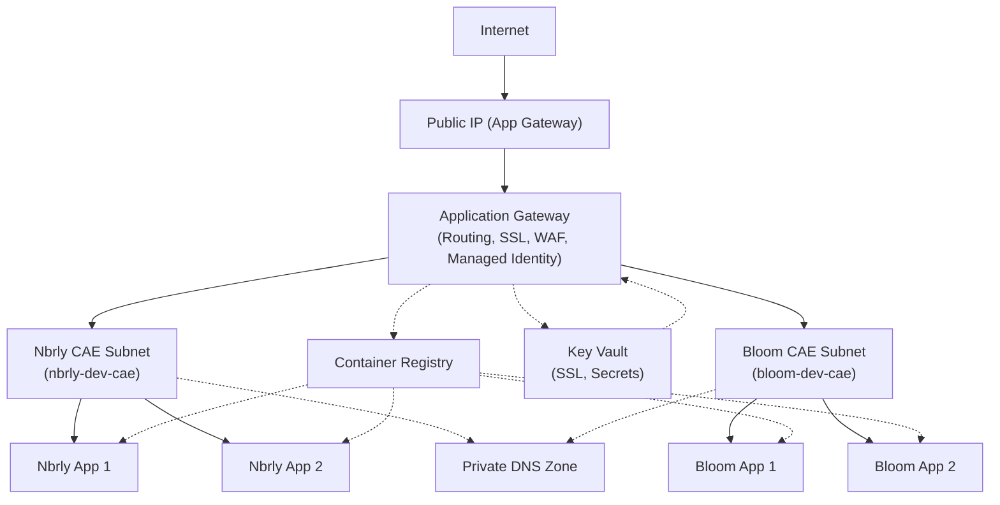
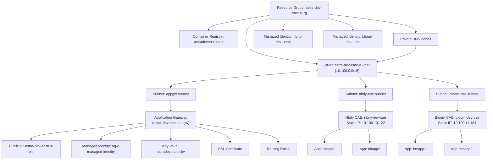
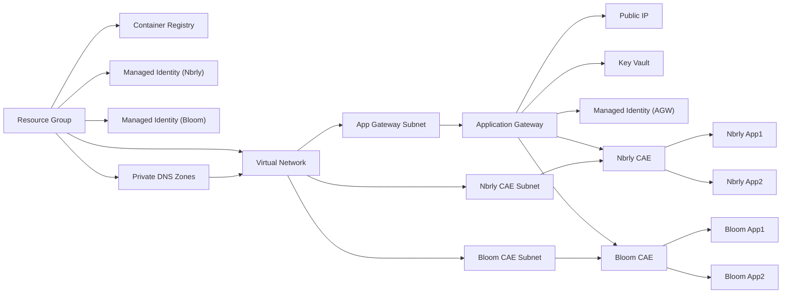
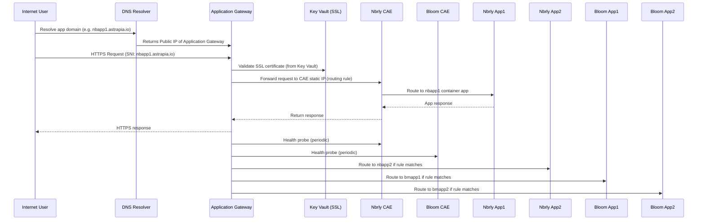

# Astra Platform - Implemented Azure Architecture

## Overview
This document describes the actual implemented architecture for the Astra multi-tenant platform, as deployed and orchestrated by the scripts and configuration files in this repository. It reflects the current state of resources, networking, routing, identity, and automation.

---

## High-Level Architecture (Mermaid)

---

## Detailed Azure Resource Map (Mermaid)

---

## Resource Inventory

### Resource Group
- **Name:** astra-dev-eastus-rg
- **Location:** eastus
- **Subscription:** 984059e7-2907-4273-8569-703dddc5adfa

### Networking
- **Virtual Network:** astra-dev-eastus-vnet (10.100.0.0/16)
  - **Subnets:**
    - appgw-subnet (Application Gateway)
    - nbrly-cae-subnet (Nbrly CAE)
    - bloom-cae-subnet (Bloom CAE)
    - Additional subnets for isolation and future expansion

### Application Gateway
- **Name:** astra-dev-eastus-agw
- **SKU:** Standard_v2
- **Subnet:** appgw-subnet
- **Public IP:** astra-dev-eastus-pip
- **Managed Identity:** agw-managed-identity
- **SSL Certificate:** Managed via Key Vault
- **Routing:**
  - Backend pools point to CAE static IPs
  - Health probes, HTTP settings, listeners, and routing rules per tenant

### Container App Environments (CAE)
- **Nbrly CAE:** nbrly-dev-cae
  - **Static IP:** 10.100.10.122
  - **Default Domain:** grayfield-aa4022a1.eastus.azurecontainerapps.io
  - **Apps:** nbapp1, nbapp2
- **Bloom CAE:** bloom-dev-cae
  - **Static IP:** 10.100.11.184
  - **Default Domain:** graycliff-28ad9dd7.eastus.azurecontainerapps.io
  - **Apps:** bmapp1, bmapp2

### Container Registry
- **Name:** astradeveastusacr
- **Scope:** Shared for all tenants

### Key Vault
- **Name:** astradeveastuskv
- **Purpose:** SSL certificates, secrets
- **Access:** Managed identities and RBAC

### Managed Identities
- **agw-managed-identity:** For Application Gateway
- **nbrly-dev-uami:** For Nbrly tenant
- **bloom-dev-uami:** For Bloom tenant

### Private DNS Zones
- **Purpose:** Custom domain resolution for CAE apps
- **VNet Links:** Created for each tenant subnet

---

## Networking & Isolation
- All resources are deployed in a single VNet for isolation.
- Subnets are delegated for Application Gateway and CAE environments.
- CAE apps are only accessible via Application Gateway (no public exposure).
- Private DNS zones ensure internal name resolution for CAE apps.

---

## Routing & Traffic Flow
- **Ingress:**
  - Internet → Public IP → Application Gateway
- **Routing:**
  - Application Gateway forwards traffic to CAE static IPs based on routing rules.
  - Health probes and HTTP settings ensure tenant isolation and health monitoring.
- **Egress:**
  - CAE apps respond via Application Gateway.

---

## Identity & Access Management
- Managed identities are used for secure access to Key Vault and other resources.
- RBAC assignments are automated via scripts.
- Each tenant has a dedicated managed identity for app deployment and access.

---

## Certificate & DNS Management
- SSL certificates are stored in Key Vault and referenced by Application Gateway.
- DNS zones are managed for custom domains and private resolution.
- VNet links connect DNS zones to tenant subnets.

---

## Automation & Script Orchestration
- **01-deploy-common-infra.sh:** Deploys shared resources (VNet, subnets, ACR, Key Vault, Application Gateway, managed identities).
- **02-deploy-tenant-infra.sh:** Wrapper for tenant-specific resource deployment.
- **03-deploy-tenant-resources.sh:** Creates CAE environments, private DNS zones, VNet links, and managed identities for each tenant.
- **04-configure-routing.sh:** Configures Application Gateway backend pools, health probes, HTTP settings, listeners, and routing rules for each tenant.
- **Configuration files:** All resource names, IDs, and properties are parameterized and tracked in infra-dev.json and parameters-dev.json.

---

## Security & Best Practices
- All secrets and certificates are stored in Key Vault.
- No direct public access to CAE apps; all ingress is via Application Gateway.
- RBAC and managed identities are used for least-privilege access.
- Private DNS and VNet links ensure secure internal resolution.

---

## Diagram (Textual)

---

## Complete Traffic Flow (Mermaid)
---

## Block Flow Diagram (Mermaid)

---

## Change Management
- All changes are tracked in configuration files and deployment logs.
- Backups are created before each deployment.
- Scripts are idempotent and safe for repeated execution.

---

## References
- See `README.md`, `DEPLOYMENT_CHANGES.md`, and script comments for further details.
- For technical design, see `app-gateway-apps-technical-design.md` and `azure-ca-appgtwy-imp-plan.md`.
